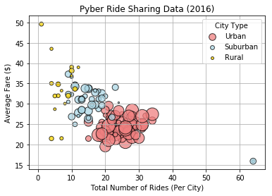
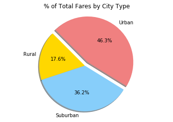
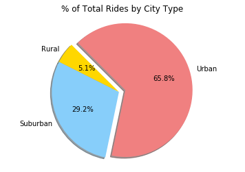
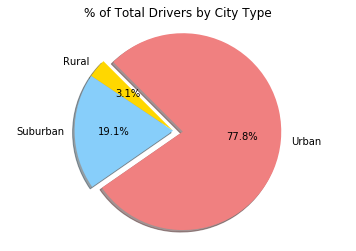

```python
# David Hui
# Pyber - 12/16/2017
```


```python
import pandas as pd
import matplotlib.pyplot as plt
import numpy as np
```


```python
city = "raw_data/city_data.csv"
ride = "raw_data/ride_data.csv"
```


```python
city_df = pd.read_csv(city, encoding="iso-8859-1",low_memory=False)
city_df.head()
```


<div>
<style>
    .dataframe thead tr:only-child th {
        text-align: right;
    }

    .dataframe thead th {
        text-align: left;
    }

    .dataframe tbody tr th {
        vertical-align: top;
    }
</style>
<table border="1" class="dataframe">
  <thead>
    <tr style="text-align: right;">
      <th></th>
      <th>city</th>
      <th>driver_count</th>
      <th>type</th>
    </tr>
  </thead>
  <tbody>
    <tr>
      <th>0</th>
      <td>Kelseyland</td>
      <td>63</td>
      <td>Urban</td>
    </tr>
    <tr>
      <th>1</th>
      <td>Nguyenbury</td>
      <td>8</td>
      <td>Urban</td>
    </tr>
    <tr>
      <th>2</th>
      <td>East Douglas</td>
      <td>12</td>
      <td>Urban</td>
    </tr>
    <tr>
      <th>3</th>
      <td>West Dawnfurt</td>
      <td>34</td>
      <td>Urban</td>
    </tr>
    <tr>
      <th>4</th>
      <td>Rodriguezburgh</td>
      <td>52</td>
      <td>Urban</td>
    </tr>
  </tbody>
</table>
</div>


```python
ride_df = pd.read_csv(ride, encoding="iso-8859-1",low_memory=False)
ride_df.head()
```


<div>
<style>
    .dataframe thead tr:only-child th {
        text-align: right;
    }

    .dataframe thead th {
        text-align: left;
    }

    .dataframe tbody tr th {
        vertical-align: top;
    }
</style>
<table border="1" class="dataframe">
  <thead>
    <tr style="text-align: right;">
      <th></th>
      <th>city</th>
      <th>date</th>
      <th>fare</th>
      <th>ride_id</th>
    </tr>
  </thead>
  <tbody>
    <tr>
      <th>0</th>
      <td>Sarabury</td>
      <td>2016-01-16 13:49:27</td>
      <td>38.35</td>
      <td>5403689035038</td>
    </tr>
    <tr>
      <th>1</th>
      <td>South Roy</td>
      <td>2016-01-02 18:42:34</td>
      <td>17.49</td>
      <td>4036272335942</td>
    </tr>
    <tr>
      <th>2</th>
      <td>Wiseborough</td>
      <td>2016-01-21 17:35:29</td>
      <td>44.18</td>
      <td>3645042422587</td>
    </tr>
    <tr>
      <th>3</th>
      <td>Spencertown</td>
      <td>2016-07-31 14:53:22</td>
      <td>6.87</td>
      <td>2242596575892</td>
    </tr>
    <tr>
      <th>4</th>
      <td>Nguyenbury</td>
      <td>2016-07-09 04:42:44</td>
      <td>6.28</td>
      <td>1543057793673</td>
    </tr>
  </tbody>
</table>
</div>


```python
###############################################################
#
#Create two data frames -  City and Ride
#
###############################################################

city_type_driver_count_df = pd.merge(ride_df, city_df, on = "city", how="outer")

city_type_driver_count_df.head()

```


<div>
<style>
    .dataframe thead tr:only-child th {
        text-align: right;
    }

    .dataframe thead th {
        text-align: left;
    }

    .dataframe tbody tr th {
        vertical-align: top;
    }
</style>
<table border="1" class="dataframe">
  <thead>
    <tr style="text-align: right;">
      <th></th>
      <th>city</th>
      <th>date</th>
      <th>fare</th>
      <th>ride_id</th>
      <th>driver_count</th>
      <th>type</th>
    </tr>
  </thead>
  <tbody>
    <tr>
      <th>0</th>
      <td>Sarabury</td>
      <td>2016-01-16 13:49:27</td>
      <td>38.35</td>
      <td>5403689035038</td>
      <td>46</td>
      <td>Urban</td>
    </tr>
    <tr>
      <th>1</th>
      <td>Sarabury</td>
      <td>2016-07-23 07:42:44</td>
      <td>21.76</td>
      <td>7546681945283</td>
      <td>46</td>
      <td>Urban</td>
    </tr>
    <tr>
      <th>2</th>
      <td>Sarabury</td>
      <td>2016-04-02 04:32:25</td>
      <td>38.03</td>
      <td>4932495851866</td>
      <td>46</td>
      <td>Urban</td>
    </tr>
    <tr>
      <th>3</th>
      <td>Sarabury</td>
      <td>2016-06-23 05:03:41</td>
      <td>26.82</td>
      <td>6711035373406</td>
      <td>46</td>
      <td>Urban</td>
    </tr>
    <tr>
      <th>4</th>
      <td>Sarabury</td>
      <td>2016-09-30 12:48:34</td>
      <td>30.30</td>
      <td>6388737278232</td>
      <td>46</td>
      <td>Urban</td>
    </tr>
  </tbody>
</table>
</div>


```python

total_ride_df = pd.DataFrame(ride_df.groupby(["city"]).count())

del total_ride_df["date"]
del total_ride_df["fare"]
total_ride_df.reset_index(inplace=True)
total_ride_df.rename(columns={"ride_id":"total rides"}, inplace=True)

total_ride_df.head()
```


<div>
<style>
    .dataframe thead tr:only-child th {
        text-align: right;
    }

    .dataframe thead th {
        text-align: left;
    }

    .dataframe tbody tr th {
        vertical-align: top;
    }
</style>
<table border="1" class="dataframe">
  <thead>
    <tr style="text-align: right;">
      <th></th>
      <th>city</th>
      <th>total rides</th>
    </tr>
  </thead>
  <tbody>
    <tr>
      <th>0</th>
      <td>Alvarezhaven</td>
      <td>31</td>
    </tr>
    <tr>
      <th>1</th>
      <td>Alyssaberg</td>
      <td>26</td>
    </tr>
    <tr>
      <th>2</th>
      <td>Anitamouth</td>
      <td>9</td>
    </tr>
    <tr>
      <th>3</th>
      <td>Antoniomouth</td>
      <td>22</td>
    </tr>
    <tr>
      <th>4</th>
      <td>Aprilchester</td>
      <td>19</td>
    </tr>
  </tbody>
</table>
</div>


```python
avg_fare_df = pd.DataFrame(city_type_driver_count_df.groupby(["city","driver_count","type"]).sum())
del avg_fare_df["ride_id"]
avg_fare_df.head()
```


<div>
<style>
    .dataframe thead tr:only-child th {
        text-align: right;
    }

    .dataframe thead th {
        text-align: left;
    }

    .dataframe tbody tr th {
        vertical-align: top;
    }
</style>
<table border="1" class="dataframe">
  <thead>
    <tr style="text-align: right;">
      <th></th>
      <th></th>
      <th></th>
      <th>fare</th>
    </tr>
    <tr>
      <th>city</th>
      <th>driver_count</th>
      <th>type</th>
      <th></th>
    </tr>
  </thead>
  <tbody>
    <tr>
      <th>Alvarezhaven</th>
      <th>21</th>
      <th>Urban</th>
      <td>741.79</td>
    </tr>
    <tr>
      <th>Alyssaberg</th>
      <th>67</th>
      <th>Urban</th>
      <td>535.85</td>
    </tr>
    <tr>
      <th>Anitamouth</th>
      <th>16</th>
      <th>Suburban</th>
      <td>335.84</td>
    </tr>
    <tr>
      <th>Antoniomouth</th>
      <th>21</th>
      <th>Urban</th>
      <td>519.75</td>
    </tr>
    <tr>
      <th>Aprilchester</th>
      <th>49</th>
      <th>Urban</th>
      <td>417.65</td>
    </tr>
  </tbody>
</table>
</div>


```python
#############################################################
#
# Avg Fare ($) Per City  == Y axis
#
#############################################################
```


```python

avg_fare_df.reset_index(inplace=True)
#avg_fare_df = pd.merge(avg_fare_df, total_ride_df, on="city")

#avg_fare_df["avg ride fare"] = avg_fare_df["fare"] / avg_fare_df["driver_count"]
#avg_fare_df["avg ride fare"] = avg_fare_df["fare"] / avg_fare_df["total rides"]     
avg_fare_df.head()                                             
                                                  
```


<div>
<style>
    .dataframe thead tr:only-child th {
        text-align: right;
    }

    .dataframe thead th {
        text-align: left;
    }

    .dataframe tbody tr th {
        vertical-align: top;
    }
</style>
<table border="1" class="dataframe">
  <thead>
    <tr style="text-align: right;">
      <th></th>
      <th>city</th>
      <th>driver_count</th>
      <th>type</th>
      <th>fare</th>
    </tr>
  </thead>
  <tbody>
    <tr>
      <th>0</th>
      <td>Alvarezhaven</td>
      <td>21</td>
      <td>Urban</td>
      <td>741.79</td>
    </tr>
    <tr>
      <th>1</th>
      <td>Alyssaberg</td>
      <td>67</td>
      <td>Urban</td>
      <td>535.85</td>
    </tr>
    <tr>
      <th>2</th>
      <td>Anitamouth</td>
      <td>16</td>
      <td>Suburban</td>
      <td>335.84</td>
    </tr>
    <tr>
      <th>3</th>
      <td>Antoniomouth</td>
      <td>21</td>
      <td>Urban</td>
      <td>519.75</td>
    </tr>
    <tr>
      <th>4</th>
      <td>Aprilchester</td>
      <td>49</td>
      <td>Urban</td>
      <td>417.65</td>
    </tr>
  </tbody>
</table>
</div>


```python
###################################################################
#
# Total number of Rides (Per City)  -- X axis
#
####################################################################

```


```python
total_ride_df = pd.DataFrame(city_type_driver_count_df.groupby(["city"]).count())
total_ride_df.reset_index(inplace=True)
#avg_fare_df["avg ride fare"] = avg_fare_df["fare"] / avg_fare_df["driver_count"]
#del avg_fare_df["ride_id"]
del total_ride_df["type"]
del total_ride_df["date"]
del total_ride_df["fare"]
del total_ride_df["ride_id"]
total_ride_df.rename(columns={"driver_count":"total rides"}, inplace=True)
total_ride_df.head()
```


<div>
<style>
    .dataframe thead tr:only-child th {
        text-align: right;
    }

    .dataframe thead th {
        text-align: left;
    }

    .dataframe tbody tr th {
        vertical-align: top;
    }
</style>
<table border="1" class="dataframe">
  <thead>
    <tr style="text-align: right;">
      <th></th>
      <th>city</th>
      <th>total rides</th>
    </tr>
  </thead>
  <tbody>
    <tr>
      <th>0</th>
      <td>Alvarezhaven</td>
      <td>31</td>
    </tr>
    <tr>
      <th>1</th>
      <td>Alyssaberg</td>
      <td>26</td>
    </tr>
    <tr>
      <th>2</th>
      <td>Anitamouth</td>
      <td>9</td>
    </tr>
    <tr>
      <th>3</th>
      <td>Antoniomouth</td>
      <td>22</td>
    </tr>
    <tr>
      <th>4</th>
      <td>Aprilchester</td>
      <td>19</td>
    </tr>
  </tbody>
</table>
</div>


```python
###################################################################
#
# Total number of Drivers (Per City)  -- Z axis
#
####################################################################

final_df = pd.merge(total_ride_df, avg_fare_df, on="city")
final_df["avg ride fare"] = final_df["fare"] / final_df["total rides"]  
final_df.head()
```


<div>
<style>
    .dataframe thead tr:only-child th {
        text-align: right;
    }

    .dataframe thead th {
        text-align: left;
    }

    .dataframe tbody tr th {
        vertical-align: top;
    }
</style>
<table border="1" class="dataframe">
  <thead>
    <tr style="text-align: right;">
      <th></th>
      <th>city</th>
      <th>total rides</th>
      <th>driver_count</th>
      <th>type</th>
      <th>fare</th>
      <th>avg ride fare</th>
    </tr>
  </thead>
  <tbody>
    <tr>
      <th>0</th>
      <td>Alvarezhaven</td>
      <td>31</td>
      <td>21</td>
      <td>Urban</td>
      <td>741.79</td>
      <td>23.928710</td>
    </tr>
    <tr>
      <th>1</th>
      <td>Alyssaberg</td>
      <td>26</td>
      <td>67</td>
      <td>Urban</td>
      <td>535.85</td>
      <td>20.609615</td>
    </tr>
    <tr>
      <th>2</th>
      <td>Anitamouth</td>
      <td>9</td>
      <td>16</td>
      <td>Suburban</td>
      <td>335.84</td>
      <td>37.315556</td>
    </tr>
    <tr>
      <th>3</th>
      <td>Antoniomouth</td>
      <td>22</td>
      <td>21</td>
      <td>Urban</td>
      <td>519.75</td>
      <td>23.625000</td>
    </tr>
    <tr>
      <th>4</th>
      <td>Aprilchester</td>
      <td>19</td>
      <td>49</td>
      <td>Urban</td>
      <td>417.65</td>
      <td>21.981579</td>
    </tr>
  </tbody>
</table>
</div>


```python
Urban_df = final_df.loc[final_df["type"] == "Urban"]
Suburban_df = final_df.loc[final_df["type"] == "Suburban"]
Rural_df = final_df.loc[final_df["type"] == "Rural"]
```


```python
Urban_z = Urban_df["driver_count"]
Urban_y = Urban_df["avg ride fare"]
Urban_x = Urban_df["total rides"]
Urban_df.head()
```


<div>
<style>
    .dataframe thead tr:only-child th {
        text-align: right;
    }

    .dataframe thead th {
        text-align: left;
    }

    .dataframe tbody tr th {
        vertical-align: top;
    }
</style>
<table border="1" class="dataframe">
  <thead>
    <tr style="text-align: right;">
      <th></th>
      <th>city</th>
      <th>total rides</th>
      <th>driver_count</th>
      <th>type</th>
      <th>fare</th>
      <th>avg ride fare</th>
    </tr>
  </thead>
  <tbody>
    <tr>
      <th>0</th>
      <td>Alvarezhaven</td>
      <td>31</td>
      <td>21</td>
      <td>Urban</td>
      <td>741.79</td>
      <td>23.928710</td>
    </tr>
    <tr>
      <th>1</th>
      <td>Alyssaberg</td>
      <td>26</td>
      <td>67</td>
      <td>Urban</td>
      <td>535.85</td>
      <td>20.609615</td>
    </tr>
    <tr>
      <th>3</th>
      <td>Antoniomouth</td>
      <td>22</td>
      <td>21</td>
      <td>Urban</td>
      <td>519.75</td>
      <td>23.625000</td>
    </tr>
    <tr>
      <th>4</th>
      <td>Aprilchester</td>
      <td>19</td>
      <td>49</td>
      <td>Urban</td>
      <td>417.65</td>
      <td>21.981579</td>
    </tr>
    <tr>
      <th>5</th>
      <td>Arnoldview</td>
      <td>31</td>
      <td>41</td>
      <td>Urban</td>
      <td>778.30</td>
      <td>25.106452</td>
    </tr>
  </tbody>
</table>
</div>


```python
Suburban_z = Suburban_df["driver_count"]
Suburban_y = Suburban_df["avg ride fare"]
Suburban_x = Suburban_df["total rides"]
Suburban_df.head()
```


<div>
<style>
    .dataframe thead tr:only-child th {
        text-align: right;
    }

    .dataframe thead th {
        text-align: left;
    }

    .dataframe tbody tr th {
        vertical-align: top;
    }
</style>
<table border="1" class="dataframe">
  <thead>
    <tr style="text-align: right;">
      <th></th>
      <th>city</th>
      <th>total rides</th>
      <th>driver_count</th>
      <th>type</th>
      <th>fare</th>
      <th>avg ride fare</th>
    </tr>
  </thead>
  <tbody>
    <tr>
      <th>2</th>
      <td>Anitamouth</td>
      <td>9</td>
      <td>16</td>
      <td>Suburban</td>
      <td>335.84</td>
      <td>37.315556</td>
    </tr>
    <tr>
      <th>6</th>
      <td>Campbellport</td>
      <td>15</td>
      <td>26</td>
      <td>Suburban</td>
      <td>505.67</td>
      <td>33.711333</td>
    </tr>
    <tr>
      <th>7</th>
      <td>Carrollbury</td>
      <td>10</td>
      <td>4</td>
      <td>Suburban</td>
      <td>366.06</td>
      <td>36.606000</td>
    </tr>
    <tr>
      <th>9</th>
      <td>Clarkstad</td>
      <td>12</td>
      <td>21</td>
      <td>Suburban</td>
      <td>372.62</td>
      <td>31.051667</td>
    </tr>
    <tr>
      <th>10</th>
      <td>Conwaymouth</td>
      <td>11</td>
      <td>18</td>
      <td>Suburban</td>
      <td>380.51</td>
      <td>34.591818</td>
    </tr>
  </tbody>
</table>
</div>


```python

Rural_z= Rural_df["driver_count"]
Rural_y = Rural_df["avg ride fare"]
Rural_x = Rural_df["total rides"]
Rural_df.head()
```


<div>
<style>
    .dataframe thead tr:only-child th {
        text-align: right;
    }

    .dataframe thead th {
        text-align: left;
    }

    .dataframe tbody tr th {
        vertical-align: top;
    }
</style>
<table border="1" class="dataframe">
  <thead>
    <tr style="text-align: right;">
      <th></th>
      <th>city</th>
      <th>total rides</th>
      <th>driver_count</th>
      <th>type</th>
      <th>fare</th>
      <th>avg ride fare</th>
    </tr>
  </thead>
  <tbody>
    <tr>
      <th>17</th>
      <td>East Leslie</td>
      <td>11</td>
      <td>9</td>
      <td>Rural</td>
      <td>370.27</td>
      <td>33.660909</td>
    </tr>
    <tr>
      <th>18</th>
      <td>East Stephen</td>
      <td>10</td>
      <td>6</td>
      <td>Rural</td>
      <td>390.53</td>
      <td>39.053000</td>
    </tr>
    <tr>
      <th>19</th>
      <td>East Troybury</td>
      <td>7</td>
      <td>3</td>
      <td>Rural</td>
      <td>232.71</td>
      <td>33.244286</td>
    </tr>
    <tr>
      <th>21</th>
      <td>Erikport</td>
      <td>8</td>
      <td>3</td>
      <td>Rural</td>
      <td>240.35</td>
      <td>30.043750</td>
    </tr>
    <tr>
      <th>25</th>
      <td>Hernandezshire</td>
      <td>9</td>
      <td>10</td>
      <td>Rural</td>
      <td>288.02</td>
      <td>32.002222</td>
    </tr>
  </tbody>
</table>
</div>


```python
plt.scatter(Urban_x, Urban_y, s=Urban_z*5, alpha=0.75, linewidths=1.0, edgecolors="black",facecolors="lightcoral",label="Urban")

plt.scatter(Suburban_x, Suburban_y, s=Suburban_z*5,linewidths=1.0, alpha=0.75, edgecolors="black",facecolors="lightblue" , label="Suburban")

plt.scatter(Rural_x, Rural_y, s=Rural_z*5, linewidths=1.0,alpha=0.75, edgecolors="black",facecolors="gold", label="Rural")

plt.title("Pyber Ride Sharing Data (2016)")
plt.ylabel("Average Fare ($)")
plt.xlabel("Total Number of Rides (Per City)")

plt.legend(loc="best", title="City Type", markerscale=0.7)

plt.grid()
plt.show()
```





```python
#########################################################
#
# % of Total Fares by City Type
#
#########################################################
```


```python
# Create a group based on the values in the 'type' column
city_type_group = final_df.groupby('type')

city_type_group.head()


```


<div>
<style>
    .dataframe thead tr:only-child th {
        text-align: right;
    }

    .dataframe thead th {
        text-align: left;
    }

    .dataframe tbody tr th {
        vertical-align: top;
    }
</style>
<table border="1" class="dataframe">
  <thead>
    <tr style="text-align: right;">
      <th></th>
      <th>city</th>
      <th>total rides</th>
      <th>driver_count</th>
      <th>type</th>
      <th>fare</th>
      <th>avg ride fare</th>
    </tr>
  </thead>
  <tbody>
    <tr>
      <th>0</th>
      <td>Alvarezhaven</td>
      <td>31</td>
      <td>21</td>
      <td>Urban</td>
      <td>741.79</td>
      <td>23.928710</td>
    </tr>
    <tr>
      <th>1</th>
      <td>Alyssaberg</td>
      <td>26</td>
      <td>67</td>
      <td>Urban</td>
      <td>535.85</td>
      <td>20.609615</td>
    </tr>
    <tr>
      <th>2</th>
      <td>Anitamouth</td>
      <td>9</td>
      <td>16</td>
      <td>Suburban</td>
      <td>335.84</td>
      <td>37.315556</td>
    </tr>
    <tr>
      <th>3</th>
      <td>Antoniomouth</td>
      <td>22</td>
      <td>21</td>
      <td>Urban</td>
      <td>519.75</td>
      <td>23.625000</td>
    </tr>
    <tr>
      <th>4</th>
      <td>Aprilchester</td>
      <td>19</td>
      <td>49</td>
      <td>Urban</td>
      <td>417.65</td>
      <td>21.981579</td>
    </tr>
    <tr>
      <th>5</th>
      <td>Arnoldview</td>
      <td>31</td>
      <td>41</td>
      <td>Urban</td>
      <td>778.30</td>
      <td>25.106452</td>
    </tr>
    <tr>
      <th>6</th>
      <td>Campbellport</td>
      <td>15</td>
      <td>26</td>
      <td>Suburban</td>
      <td>505.67</td>
      <td>33.711333</td>
    </tr>
    <tr>
      <th>7</th>
      <td>Carrollbury</td>
      <td>10</td>
      <td>4</td>
      <td>Suburban</td>
      <td>366.06</td>
      <td>36.606000</td>
    </tr>
    <tr>
      <th>9</th>
      <td>Clarkstad</td>
      <td>12</td>
      <td>21</td>
      <td>Suburban</td>
      <td>372.62</td>
      <td>31.051667</td>
    </tr>
    <tr>
      <th>10</th>
      <td>Conwaymouth</td>
      <td>11</td>
      <td>18</td>
      <td>Suburban</td>
      <td>380.51</td>
      <td>34.591818</td>
    </tr>
    <tr>
      <th>17</th>
      <td>East Leslie</td>
      <td>11</td>
      <td>9</td>
      <td>Rural</td>
      <td>370.27</td>
      <td>33.660909</td>
    </tr>
    <tr>
      <th>18</th>
      <td>East Stephen</td>
      <td>10</td>
      <td>6</td>
      <td>Rural</td>
      <td>390.53</td>
      <td>39.053000</td>
    </tr>
    <tr>
      <th>19</th>
      <td>East Troybury</td>
      <td>7</td>
      <td>3</td>
      <td>Rural</td>
      <td>232.71</td>
      <td>33.244286</td>
    </tr>
    <tr>
      <th>21</th>
      <td>Erikport</td>
      <td>8</td>
      <td>3</td>
      <td>Rural</td>
      <td>240.35</td>
      <td>30.043750</td>
    </tr>
    <tr>
      <th>25</th>
      <td>Hernandezshire</td>
      <td>9</td>
      <td>10</td>
      <td>Rural</td>
      <td>288.02</td>
      <td>32.002222</td>
    </tr>
  </tbody>
</table>
</div>


```python
#fare_sum = city_type_group["fare"].sum()

fare_sum_df = pd.DataFrame(final_df.groupby(["type"]).sum())

total_fare = fare_sum_df["avg ride fare"].sum()
fare_sum_df
```


<div>
<style>
    .dataframe thead tr:only-child th {
        text-align: right;
    }

    .dataframe thead th {
        text-align: left;
    }

    .dataframe tbody tr th {
        vertical-align: top;
    }
</style>
<table border="1" class="dataframe">
  <thead>
    <tr style="text-align: right;">
      <th></th>
      <th>total rides</th>
      <th>driver_count</th>
      <th>fare</th>
      <th>avg ride fare</th>
    </tr>
    <tr>
      <th>type</th>
      <th></th>
      <th></th>
      <th></th>
      <th></th>
    </tr>
  </thead>
  <tbody>
    <tr>
      <th>Rural</th>
      <td>125</td>
      <td>104</td>
      <td>4255.09</td>
      <td>615.728572</td>
    </tr>
    <tr>
      <th>Suburban</th>
      <td>721</td>
      <td>638</td>
      <td>20335.69</td>
      <td>1268.627391</td>
    </tr>
    <tr>
      <th>Urban</th>
      <td>1625</td>
      <td>2607</td>
      <td>40078.34</td>
      <td>1623.863390</td>
    </tr>
  </tbody>
</table>
</div>


```python
for index, row in fare_sum_df.iterrows():
    percent = ((row["avg ride fare"] / total_fare) * 100)
    fare_sum_df.set_value(index, "percentage", percent)

#fare_sum_df["percentage"] = fare_sum_df["percentage"].map("{0:,.2f}%".format)
#del fare_sum_df["total rides"]
#del fare_sum_df["driver_count"]
#del fare_sum_df["fare"]
#del fare_sum_df["avg ride fare"]

fare_sum_df.sort_values(by=["percentage"])
fare_sum_df.head()
```


<div>
<style>
    .dataframe thead tr:only-child th {
        text-align: right;
    }

    .dataframe thead th {
        text-align: left;
    }

    .dataframe tbody tr th {
        vertical-align: top;
    }
</style>
<table border="1" class="dataframe">
  <thead>
    <tr style="text-align: right;">
      <th></th>
      <th>total rides</th>
      <th>driver_count</th>
      <th>fare</th>
      <th>avg ride fare</th>
      <th>percentage</th>
    </tr>
    <tr>
      <th>type</th>
      <th></th>
      <th></th>
      <th></th>
      <th></th>
      <th></th>
    </tr>
  </thead>
  <tbody>
    <tr>
      <th>Rural</th>
      <td>125</td>
      <td>104</td>
      <td>4255.09</td>
      <td>615.728572</td>
      <td>17.551028</td>
    </tr>
    <tr>
      <th>Suburban</th>
      <td>721</td>
      <td>638</td>
      <td>20335.69</td>
      <td>1268.627391</td>
      <td>36.161576</td>
    </tr>
    <tr>
      <th>Urban</th>
      <td>1625</td>
      <td>2607</td>
      <td>40078.34</td>
      <td>1623.863390</td>
      <td>46.287396</td>
    </tr>
  </tbody>
</table>
</div>


```python

explode = (0, 0, 0.10)
labels=[]
pert=[]
colors=[]
for index, row in fare_sum_df.iterrows():
    labels.append(index)
    pert.append(row["percentage"])
    if index == 'Urban':
        colors.append('lightcoral')
    else :
        if index == 'Suburban':
            colors.append('lightskyblue')
        else:
            colors.append('gold')
    
plt.pie(pert, explode=explode, labels=labels, colors=colors,
       autopct="%1.1f%%", shadow=True, startangle=135)
plt.title("% of Total Fares by City Type")
plt.axis("equal")
plt.show()
```





```python
################################################################
#
# TotalRides by City Type
#
################################################################

```


```python
total_rides = fare_sum_df["total rides"].sum()

for index, row in fare_sum_df.iterrows():
    percent = ((row["total rides"] / total_rides) * 100)
    fare_sum_df.set_value(index, "% total rides", percent)
fare_sum_df.sort_values(by=["% total rides"])   
```


<div>
<style>
    .dataframe thead tr:only-child th {
        text-align: right;
    }

    .dataframe thead th {
        text-align: left;
    }

    .dataframe tbody tr th {
        vertical-align: top;
    }
</style>
<table border="1" class="dataframe">
  <thead>
    <tr style="text-align: right;">
      <th></th>
      <th>total rides</th>
      <th>driver_count</th>
      <th>fare</th>
      <th>avg ride fare</th>
      <th>percentage</th>
      <th>% total rides</th>
    </tr>
    <tr>
      <th>type</th>
      <th></th>
      <th></th>
      <th></th>
      <th></th>
      <th></th>
      <th></th>
    </tr>
  </thead>
  <tbody>
    <tr>
      <th>Rural</th>
      <td>125</td>
      <td>104</td>
      <td>4255.09</td>
      <td>615.728572</td>
      <td>17.551028</td>
      <td>5.058681</td>
    </tr>
    <tr>
      <th>Suburban</th>
      <td>721</td>
      <td>638</td>
      <td>20335.69</td>
      <td>1268.627391</td>
      <td>36.161576</td>
      <td>29.178470</td>
    </tr>
    <tr>
      <th>Urban</th>
      <td>1625</td>
      <td>2607</td>
      <td>40078.34</td>
      <td>1623.863390</td>
      <td>46.287396</td>
      <td>65.762849</td>
    </tr>
  </tbody>
</table>
</div>


```python

    
explode = (0, 0, 0.10)
labels=[]
pert=[]
colors=[]
for index, row in fare_sum_df.iterrows():
    labels.append(index)
    pert.append(row["% total rides"])
    if index == 'Urban':
        colors.append('lightcoral')
    else :
        if index == 'Suburban':
            colors.append('lightskyblue')
        else:
            colors.append('gold')
            
plt.pie(pert, explode=explode, labels=labels, colors=colors,
       autopct="%1.1f%%", shadow=True, startangle=135)
plt.title("% of Total Rides by City Type")
plt.axis("equal")
plt.show()
```





```python
total_drivers = fare_sum_df["driver_count"].sum()

for index, row in fare_sum_df.iterrows():
    percent = ((row["driver_count"] / total_drivers) * 100)
    fare_sum_df.set_value(index, "% total drivers", percent)
fare_sum_df.sort_values(by=["% total drivers"])  

```


<div>
<style>
    .dataframe thead tr:only-child th {
        text-align: right;
    }

    .dataframe thead th {
        text-align: left;
    }

    .dataframe tbody tr th {
        vertical-align: top;
    }
</style>
<table border="1" class="dataframe">
  <thead>
    <tr style="text-align: right;">
      <th></th>
      <th>total rides</th>
      <th>driver_count</th>
      <th>fare</th>
      <th>avg ride fare</th>
      <th>percentage</th>
      <th>% total rides</th>
      <th>% total drivers</th>
    </tr>
    <tr>
      <th>type</th>
      <th></th>
      <th></th>
      <th></th>
      <th></th>
      <th></th>
      <th></th>
      <th></th>
    </tr>
  </thead>
  <tbody>
    <tr>
      <th>Rural</th>
      <td>125</td>
      <td>104</td>
      <td>4255.09</td>
      <td>615.728572</td>
      <td>17.551028</td>
      <td>5.058681</td>
      <td>3.105405</td>
    </tr>
    <tr>
      <th>Suburban</th>
      <td>721</td>
      <td>638</td>
      <td>20335.69</td>
      <td>1268.627391</td>
      <td>36.161576</td>
      <td>29.178470</td>
      <td>19.050463</td>
    </tr>
    <tr>
      <th>Urban</th>
      <td>1625</td>
      <td>2607</td>
      <td>40078.34</td>
      <td>1623.863390</td>
      <td>46.287396</td>
      <td>65.762849</td>
      <td>77.844133</td>
    </tr>
  </tbody>
</table>
</div>


```python
explode = (0, 0, 0.10)
labels=[]
pert=[]
colors=[]
for index, row in fare_sum_df.iterrows():
    labels.append(index)
    pert.append(row["% total drivers"])
    if index == 'Urban':
        colors.append('lightcoral')
    else :
        if index == 'Suburban':
            colors.append('lightskyblue')
        else:
            colors.append('gold')
            
plt.pie(pert, explode=explode, labels=labels, colors=colors,
       autopct="%1.1f%%", shadow=True, startangle=135)
plt.title("% of Total Drivers by City Type")
plt.axis("equal")
plt.show()
```





```python
###########################################################################
##  Three Observations:
##
##  1. Urban has more rides , generate more revenue and has more drivers
##  2. Suburban has moderate number of rides, number of drivers and revenue
##  3. Rural has least number of rides, revenue and number of drivers
##
##
############################################################################
```
